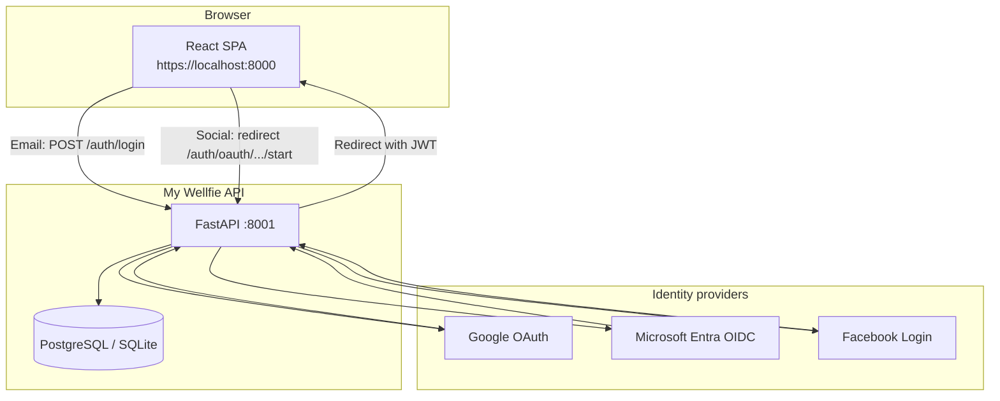
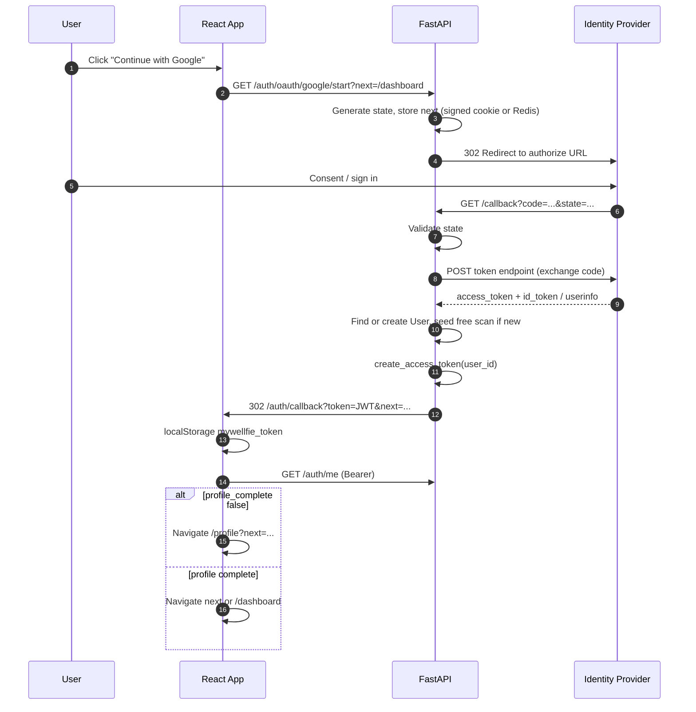

# OAuth / Social Sign-In Architecture

**My Wellfie** — Google, Microsoft, and Facebook single sign-on  
**Status:** Implemented (configure provider client IDs in `.env` to enable)  
**Last updated:** May 2026  
**Related docs:** [auth.md](./auth.md) (email/password today), [backend-plan.md](./backend-plan.md)

---

## 1. Executive summary

The login UI already shows **Continue with Google**, **Microsoft**, and **Facebook**, but those buttons only display *“coming soon”*. Email/password auth is fully working (bcrypt + JWT).

This document defines how to add **real social sign-in** without replacing the existing stack:

- Keep **the same JWT** (`Authorization: Bearer`) and `AuthContext` on the frontend.
- Run **OAuth 2.0 authorization code flow on the FastAPI backend** (recommended), then redirect the browser back to the React app with a token.
- **Sign up and sign in are one flow** per provider (“Continue with …” creates or logs in the user).
- Reuse existing rules: **1 free scan** on first account creation, **health profile** gate before camera, Stripe, scan storage unchanged.

---

## 2. Goals and non-goals

### Goals

| # | Goal |
|---|------|
| G1 | User can sign in or sign up with Google, Microsoft, or Facebook from `AuthPage`. |
| G2 | After OAuth, user receives the **same JWT** as email login and can call all protected APIs. |
| G3 | New OAuth users get **1 free `ScanSession`** (same as `POST /auth/signup`). |
| G4 | OAuth users without a complete health profile are sent to **`/profile`** before `/camera`. |
| G5 | Secrets (client secrets) stay **server-side** only. |
| G6 | CSRF protection via OAuth **`state`** parameter. |

### Non-goals (phase 1)

| # | Out of scope initially |
|---|------------------------|
| N1 | Apple Sign In (can add later; same pattern). |
| N2 | Magic link / passwordless email. |
| N3 | Replacing JWT with session cookies (optional future hardening). |
| N4 | Enterprise SAML (only OIDC/OAuth2 for Microsoft personal + work via `common` tenant). |
| N5 | Meta app review / production Facebook until Google + Microsoft are stable. |

---

## 3. Current state (as-built)

### Frontend (`my-welfie`)

| Piece | Status |
|-------|--------|
| `AuthPage.tsx` | Social buttons on **sign-in** only; `handleSocial()` shows placeholder message. |
| `AuthContext.tsx` | `login`, `signup`, `token` in `localStorage` key `mywellfie_token`. |
| `App.tsx` | `ProtectedRoute`, `ProfileRequiredRoute` for `/camera`. |
| `api/config.ts` | `API_BASE` → `http://localhost:8001` (dev). |

### Backend (`my-welfie-backend`)

| Piece | Status |
|-------|--------|
| `POST /auth/signup` | Email + password; seeds free scan. |
| `POST /auth/login` | Returns JWT. |
| `GET /auth/me` | Profile + `profile_complete`. |
| `PATCH /auth/me/profile` | Health profile (DOB → stored `age`). |
| `app/utils/auth.py` | bcrypt + `python-jose` JWT. |
| `users.hashed_password` | **NOT NULL** today — blocks OAuth-only users. |
| OAuth libraries | **None** in `requirements.txt`. |

### UI providers vs implementation

| Provider | UI (sign-in) | Backend |
|----------|----------------|---------|
| Google | Yes | Not implemented |
| Microsoft | Yes | Not implemented |
| Facebook | Yes | Not implemented |

---

## 4. Recommended approach

### Decision: backend-led OAuth 2.0 (authorization code flow)

```text
React  →  FastAPI /auth/oauth/{provider}/start  →  IdP (Google / Microsoft / Facebook)
         ←  FastAPI /auth/oauth/{provider}/callback  ←  IdP (authorization code)
FastAPI  →  redirect to React /auth/callback?token=<JWT>&next=...
React    →  store JWT, GET /auth/me, navigate to profile or dashboard
```

**Why not only frontend SDKs (e.g. Google GIS)?**

- Three different SDKs and token shapes vs **one backend pattern**.
- Same JWT issuance path as email login.
- Client secrets never exposed to the browser.

**Why not Auth0 / Clerk / Supabase first?**

- Valid for speed; adds cost and user-store sync.
- Self-hosted OAuth fits the existing `users` table and Railway deploy model.
- Can migrate to managed auth later if needed.

---

## 5. System context



---

## 6. Detailed sequence (happy path)



---

## 7. Data model changes

### 7.1 `users` table (proposed)

| Column | Type | Notes |
|--------|------|--------|
| `id` | UUID string | Unchanged (PK). |
| `email` | string, unique | From IdP; required for receipts/support. |
| `hashed_password` | string, **nullable** | `NULL` for OAuth-only users. |
| `auth_provider` | string | `email` \| `google` \| `microsoft` \| `facebook`. |
| `provider_subject` | string, nullable | IdP stable subject (`sub` / object id). |
| `full_name` | string, nullable | From IdP profile. |
| `avatar_url` | string, nullable | Optional; from IdP picture. |
| `is_verified` | bool | Set `true` when IdP asserts `email_verified`. |
| Health profile fields | … | Unchanged (`sex`, `date_of_birth`, `age`, …). |
| `created_at` / `updated_at` | datetime | Already exist on `users`. |

**Indexes (recommended):**

```sql
UNIQUE (auth_provider, provider_subject)  -- where provider_subject IS NOT NULL
UNIQUE (email)                            -- already
```

### 7.2 Optional: `oauth_identities` (multi-provider linking)

If one user should link **both** Google and Microsoft:

| Column | Purpose |
|--------|---------|
| `user_id` | FK → `users.id` |
| `provider` | `google` / `microsoft` / `facebook` |
| `provider_subject` | IdP subject |
| `created_at` | Audit |

Phase 1 can use columns on `users` only; add this table when supporting multiple providers per account.

### 7.3 Migration notes

- Use existing `app/db_migrate.py` pattern (ALTER TABLE) or Alembic for production.
- Existing email users: `auth_provider = 'email'`, `hashed_password` unchanged.
- Make `hashed_password` nullable before enabling OAuth signup.

---

## 8. Account linking and conflicts

| Scenario | Recommended behaviour |
|----------|-------------------------|
| New email from Google | Create user, `auth_provider=google`, seed free scan. |
| Existing email/password user signs in with Google (same email) | **Link** if Google returns `email_verified`; attach `provider_subject`, keep password optional. |
| Google email already used by **another** Google account | 409 or “use original sign-in method”. |
| User has Google only, tries email signup with same email | 409 “Account exists — sign in with Google”. |
| Microsoft personal + work same email | Use `provider_subject` as primary key, not email alone. |

Document the chosen policy in API error messages (`detail` strings).

---

## 9. API design (new endpoints)

Base prefix: `/auth` (same router or `app/routers/oauth.py`).

| Method | Path | Description |
|--------|------|-------------|
| `GET` | `/auth/oauth/{provider}/start` | `provider` ∈ `google`, `microsoft`, `facebook`. Query: `next` (post-login path). Sets `state`, redirects to IdP. |
| `GET` | `/auth/oauth/{provider}/callback` | Exchanges `code`, upserts user, issues JWT, redirects to frontend. |
| `GET` | `/auth/oauth/providers` | Optional: which providers are configured (for UI to hide disabled buttons). |

**Unchanged endpoints:**

- `POST /auth/login`, `POST /auth/signup` — email/password.
- `GET /auth/me`, `PATCH /auth/me/profile`.

### 9.1 Callback redirect to frontend

Success redirect (example):

```text
{FRONTEND_URL}/auth/callback?token={access_token}&next={urlencoded_next}
```

Error redirect (example):

```text
{FRONTEND_URL}/auth/callback?error=access_denied&error_description=...
```

**Security:** Prefer **short-lived token in query** only over HTTPS, then strip from URL with `history.replaceState`. Alternative: one-time code exchanged via `POST /auth/oauth/exchange` (slightly more work, avoids token in logs).

### 9.2 JWT payload

Same as today — only `user_id` (or `sub`) in token; load user from DB on each request via `get_current_user`.

---

## 10. Provider-specific configuration

### 10.1 Google

| Item | Value |
|------|--------|
| Console | [Google Cloud Console](https://console.cloud.google.com/) → APIs & Services → Credentials |
| Type | OAuth 2.0 Client ID — **Web application** |
| Redirect URI | `http://localhost:8001/auth/oauth/google/callback` (dev) |
| Scopes | `openid email profile` |
| Discovery | `https://accounts.google.com/.well-known/openid-configuration` |

### 10.2 Microsoft (Entra ID)

| Item | Value |
|------|--------|
| Console | [Azure Portal](https://portal.azure.com/) → App registrations |
| Type | Web redirect URI |
| Redirect URI | `http://localhost:8001/auth/oauth/microsoft/callback` |
| Authority | `https://login.microsoftonline.com/{tenant}/v2.0` |
| Tenant | `common` (personal + work/school) or single-tenant for org-only |
| Scopes | `openid profile email User.Read` |

### 10.3 Facebook

| Item | Value |
|------|--------|
| Console | [Meta for Developers](https://developers.facebook.com/) → Facebook Login |
| Redirect URI | `http://localhost:8001/auth/oauth/facebook/callback` |
| Scopes | `email public_profile` (email requires app permissions / review for production) |
| Note | Graph API user id is the stable `provider_subject` |

---

## 11. Environment variables

Add to `my-welfie-backend/.env` (and Railway):

```env
# ── OAuth (proposed) ─────────────────────────────────────────────────────────

# Frontend base URL (already exists)
FRONTEND_URL=https://localhost:8000

# Google
GOOGLE_CLIENT_ID=
GOOGLE_CLIENT_SECRET=
GOOGLE_REDIRECT_URI=http://localhost:8001/auth/oauth/google/callback

# Microsoft Entra
MICROSOFT_CLIENT_ID=
MICROSOFT_CLIENT_SECRET=
MICROSOFT_TENANT_ID=common
MICROSOFT_REDIRECT_URI=http://localhost:8001/auth/oauth/microsoft/callback

# Facebook
FACEBOOK_APP_ID=
FACEBOOK_APP_SECRET=
FACEBOOK_REDIRECT_URI=http://localhost:8001/auth/oauth/facebook/callback

# Optional: dedicated callback path on frontend (default /auth/callback)
OAUTH_FRONTEND_CALLBACK_PATH=/auth/callback
```

Wire into `app/config.py` when implementing.

---

## 12. Frontend changes

### 12.1 `AuthPage.tsx`

Replace `handleSocial`:

```typescript
const startOAuth = (provider: 'google' | 'microsoft' | 'facebook') => {
  const next = encodeURIComponent(from);
  window.location.href = `${API_BASE}/auth/oauth/${provider}/start?next=${next}`;
};
```

- Show social buttons on **sign-up** as well as sign-in (same handlers).
- Optionally call `GET /auth/oauth/providers` to hide unconfigured providers.

### 12.2 New page: `OAuthCallbackPage.tsx`

Route: `/auth/callback` in `App.tsx`.

```text
1. Parse ?token= or ?error=
2. If token: localStorage.setItem('mywellfie_token', token)
3. Fetch GET /auth/me
4. If !profile_complete → /profile?next=...
5. Else → decode next or /dashboard
6. history.replaceState to remove token from URL
```

### 12.3 `AuthContext.tsx`

Add:

```typescript
loginWithToken: (accessToken: string) => Promise<void>;
```

Shared by email flow (optional refactor) and OAuth callback.

### 12.4 CORS and redirects

- API already allows `allow_origins=["*"]` in dev.
- OAuth **redirect URIs** must be registered exactly in each provider console (backend callback URL, not React port).

---

## 13. Backend implementation structure (proposed)

```text
my-welfie-backend/
  app/
    routers/
      auth.py              # existing email routes
      oauth.py             # NEW: start + callback per provider
    services/
      oauth_service.py     # NEW: provider clients, user upsert
    utils/
      auth.py              # JWT (unchanged)
      oauth_state.py       # NEW: sign/verify state cookie
    models/
      user.py              # + auth_provider, provider_subject, nullable password
    schemas/
      oauth.py             # NEW: optional ProviderListOut
  dev-docs/
    oauth-sso-architecture.md   # this file
```

### 13.1 Dependencies (`requirements.txt`)

```text
authlib>=1.3.0
httpx>=0.27.0
```

Use Authlib’s Starlette/FastAPI integration or manual `AsyncOAuth2Client`.

### 13.2 User upsert pseudocode

```python
def upsert_user_from_oauth(provider, subject, email, name, email_verified, picture):
    user = db.query(User).filter(
        User.auth_provider == provider,
        User.provider_subject == subject,
    ).first()

    if not user and email:
        user = db.query(User).filter(User.email == email).first()
        if user and user.auth_provider == "email":
            # link policy: attach provider_subject, set is_verified if IdP verified
            ...

    if not user:
        user = User(
            email=email,
            auth_provider=provider,
            provider_subject=subject,
            hashed_password=None,
            full_name=name,
            is_verified=email_verified,
            avatar_url=picture,
        )
        db.add(user)
        db.flush()
        seed_free_scan(user.id)  # same as signup

    return user
```

---

## 14. Security checklist

| Topic | Requirement |
|-------|-------------|
| CSRF | Random `state`; verify on callback; bind `next` inside signed state if possible |
| Secrets | `CLIENT_SECRET` only in backend `.env` / Railway |
| Redirect URI allowlist | Exact match in Google/Azure/Facebook consoles |
| Token in URL | HTTPS only; remove from browser history after read |
| Email verification | Trust IdP `email_verified` before auto-linking to existing email account |
| JWT | Same `SECRET_KEY`, expiry as email login (`ACCESS_TOKEN_EXPIRE_MINUTES`) |
| Logout | Client clears `localStorage`; no server session to revoke (stateless JWT) |

---

## 15. Post-login product flows (unchanged logic)

| Step | OAuth user | Email user |
|------|------------|------------|
| First account | 1 free scan (`ScanSession`) | Same |
| Profile incomplete | `ProfileRequiredRoute` → `/profile` | Same |
| Camera | `userInformation` from stored profile | Same |
| Stripe | JWT on checkout API calls | Same |

---

## 16. Phased rollout

| Phase | Deliverable | Est. effort |
|-------|-------------|-------------|
| **P0** | This architecture doc + env template | Done |
| **P1** | DB migration, nullable password, `auth_provider` columns | 0.5 day |
| **P2** | Google OAuth end-to-end + `/auth/callback` page | 1–1.5 days |
| **P3** | Microsoft Entra OIDC | 0.5–1 day |
| **P4** | Facebook Login | 0.5–1 day |
| **P5** | Account linking rules + tests + update [auth.md](./auth.md) | 1 day |
| **P6** | Production redirect URIs on Railway + provider consoles | 0.5 day |

---

## 17. Testing plan

### Manual

- [ ] Google: new user → profile → scan → dashboard shows 1 scan left  
- [ ] Google: returning user → lands on `next` URL  
- [ ] Microsoft: same flows  
- [ ] Facebook: same flows (dev mode testers added in Meta console)  
- [ ] Email user + same email Google → linking behaviour matches policy  
- [ ] Invalid `state` on callback → error page, no JWT issued  
- [ ] Cancel at IdP → friendly error on `/auth/callback`  

### Automated (recommended)

- Unit: `upsert_user_from_oauth` linking matrix  
- Integration: mock token exchange, assert JWT validates on `GET /auth/me`  

---

## 18. Local development URLs reference

| Service | URL |
|---------|-----|
| React (webpack) | `https://localhost:8000` |
| FastAPI | `http://localhost:8001` |
| API docs | `http://localhost:8001/docs` |
| OAuth success landing | `https://localhost:8000/auth/callback` |
| Google callback (backend) | `http://localhost:8001/auth/oauth/google/callback` |

Note: Frontend uses **HTTPS** (BioSense camera); backend OAuth callbacks are typically **HTTP** on localhost unless you terminate TLS on 8001.

---

## 19. Alternatives considered

| Option | Pros | Cons |
|--------|------|------|
| **Backend OAuth (chosen)** | Unified JWT, one pattern for 3 providers | More backend code |
| **Auth0 / Clerk** | Fast, hosted UI | Cost, vendor lock-in, user sync |
| **Firebase Auth** | Easy Google on web | Different token model; refactor protected routes |
| **Frontend-only Google GIS** | Quick for Google alone | Microsoft/Facebook need separate flows |

---

## 20. Open decisions (confirm before implementation)

1. **Account linking:** Auto-link same verified email, or force separate accounts?  
2. **Token delivery:** Query param `?token=` vs one-time exchange code?  
3. **Facebook in phase 1:** Include or ship Google + Microsoft first?  
4. **`is_verified`:** Set `true` for all OAuth users with `email_verified` from IdP?  
5. **Sign-up UI:** Show social buttons on signup tab or only sign-in?

---

## 21. Implementation checklist (copy to PR)

**Backend**

- [ ] Extend `User` model + migration  
- [ ] `app/config.py` OAuth env vars  
- [ ] `app/routers/oauth.py` start/callback  
- [ ] `oauth_service.py` upsert + free scan  
- [ ] Register router in `main.py`  
- [ ] `.env.example` entries  

**Frontend**

- [ ] `OAuthCallbackPage` + route  
- [ ] Wire social buttons in `AuthPage`  
- [ ] `AuthContext.loginWithToken`  
- [ ] Error UI on failed OAuth  

**Ops**

- [ ] Google Cloud OAuth client  
- [ ] Azure app registration  
- [ ] Facebook app (dev testers)  
- [ ] Railway production redirect URIs  

**Docs**

- [ ] Update [auth.md](./auth.md) and [PROGRESS.md](../../PROGRESS.md)  

---

*End of document*
